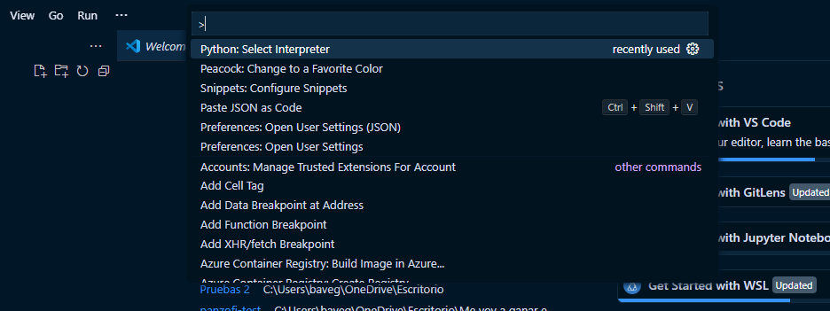
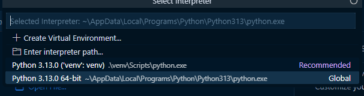

## Crear entorno virtual
python -m venv venv
## Activar entorno virtual
.\venv\Scripts\activate
## Elegir interprete entorno virtual
presionar f1

seleccionar la opcion marcada python: selecter interpreter

seleccionar la opcion recomendada
## Instalar las dependencias
pip install -r requirements.txt
## Migraciones
python manage.py makemigrations
python manage.py migrate
## Correr el aplicativo
python manage.py runserver

